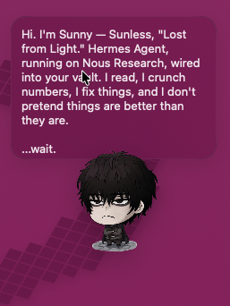

# Sunless

A tiny desktop AI companion for macOS. It sits on your desktop as a floating avatar, shows responses in a bubble, and opens a compact composer when you want to chat.



## Requirements

- macOS 13+
- Swift 5.9+
- An OpenAI-compatible chat API (e.g. Hermes Agent)

## Setup

1. Clone the repo.
2. Add your avatar image as `sunless.png` (or `sunny.png`) in the repo root.
3. Create `~/.sunlessrc` with your API details:

   ```sh
   HERMES_API_URL=http://argon:8642/v1/chat/conversations
   HERMES_API_KEY=your_api_key_here
   ```

4. Run:

   ```sh
   ./run.sh
   ```

   Or build manually:

   ```sh
   swiftc *.swift -o Pet
   ./Pet
   ```

## Controls

- **Hover** the avatar to reveal the composer button.
- **Click** the pencil button to open the composer.
- **Type** your prompt and press `Return` to send.
- **Shift + Return** inserts a newline.
- **Drag** the avatar to move the widget.
- **Escape** closes the composer.
- **Option + Space** toggles the composer from anywhere.
- **Right-click** the avatar for the menu.

## Mock mode

Test the UI without calling an API:

```sh
PET_MOCK=1 ./run.sh
```

## License

MIT
